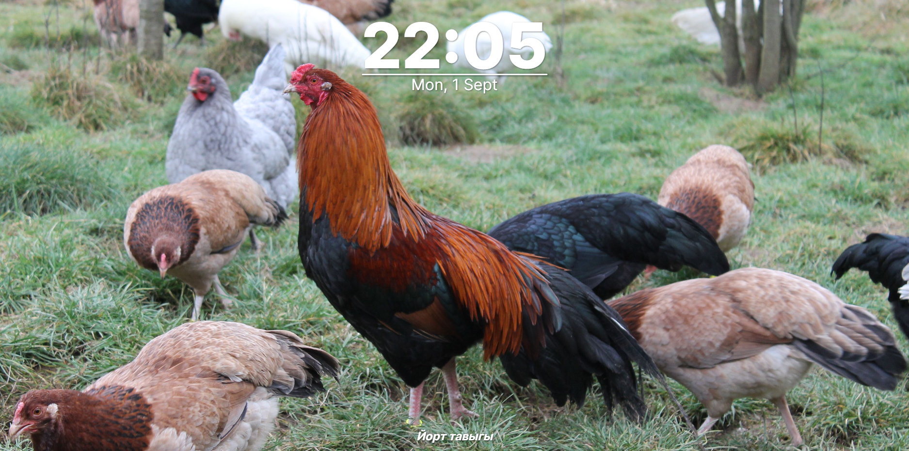

# RandTab

### Random stunning, interesting, out-of-pocket or weird images for your new tab from Wikipedia.

Transform your new tab into a daily source of inspiration. RandTab displays a random high-quality image every time you open a new tab, creating a fresh, beautiful backdrop. Images are pulled from a wide variety of sources, offering a subtle touch of global knowledge and artistry without cluttering your experience (don't take this extension too seriously).
